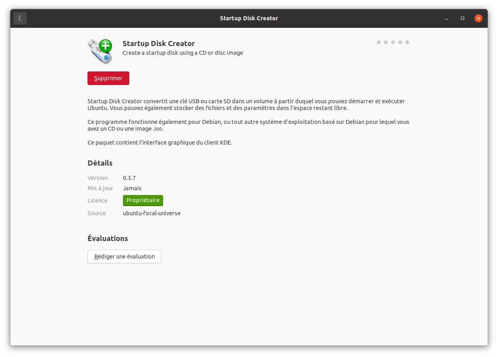
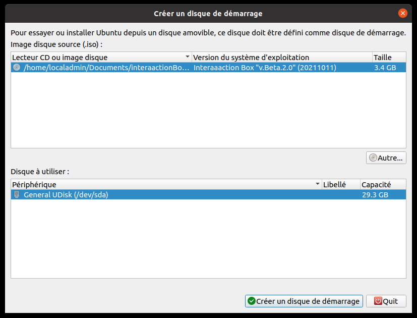
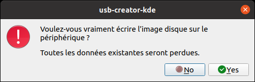
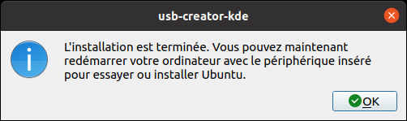

# InterAACtionBox-Live

## Etape 1: Téléchargement de l'ISO

Le fichier est disponible ici :
- https://www.swisstransfer.com/d/977a58c2-4174-4bf3-84b9-ff84378b28ae

## Etape 2: Graver l'ISO téléchargé sur la clé USB
- Utiliser Startup Disk Creator sur Ubuntu

Lorsque vous télécharger startup Disk creator vous devrez avoir cette image.

Il vous faudra choisir le périphérique où vous voudrez graver l'ISO.    
Puis aller cherche l'ISO que vous voulez graver.

Au moment graver l'ISO sur la clé USB, une fenêtre d'avertissement apparaîtra.

Il faut cliquer sur oui.

Après plusieurs minutes d'attente, vous devriez obtenir cette fenêtre si tout s'est bien passé.

- Utiliser [Rufus](https://rufus.ie/en/) on Window (download here https://rufus.ie/en/)

- Utiliser [mac tool](https://ipom.fr/2019/07/03/creer-windows-10-bootable-graver-un-fichier-iso-sur-usb-dvd-cd-sur-mac-os-x/) on Mac
## Step 3: insert the key in the computer
cf https://github.com/InteraactionGroup/InterAACtionBox to see which PC we selected

## Step 4: boot on the USB key
- 2 ways to access the [BIOS menu](https://www.dell.com/support/kbdoc/fr-fr/000126121/acc%c3%a8s-%c3%a0-la-configuration-syst%c3%a8me-uefi-bios-sous-windows-sur-votre-syst%c3%a8me-dell#:~:text=Appuyez%20sur%20la%20touche%20F2%3E%20sur%20l'%C3%A9cran%20du%20logo,pendant%20le%20d%C3%A9marrage%20du%20syst%C3%A8me)
- When you are inside the menu, you must go to the boot tab and put the USB device in the first line then apply changes and exit the menu, Restart the computer.

## Step 5: install the OS selecting "minimal" install
You must be connected to the internet to access the box launcher interaction

## Bug case
If the interaction box blocks you in the menus and you need to exit, turn on the computer, get out of the standby mode and go to the user menu, then restart the computer
