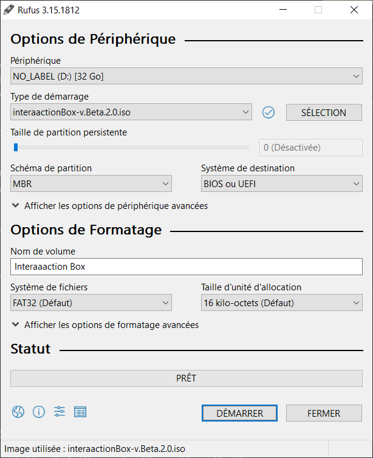
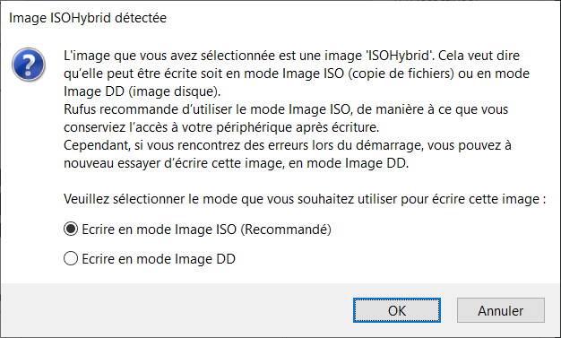
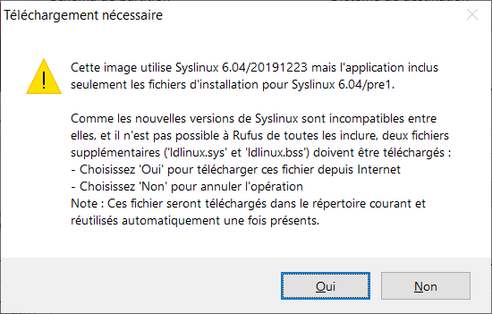
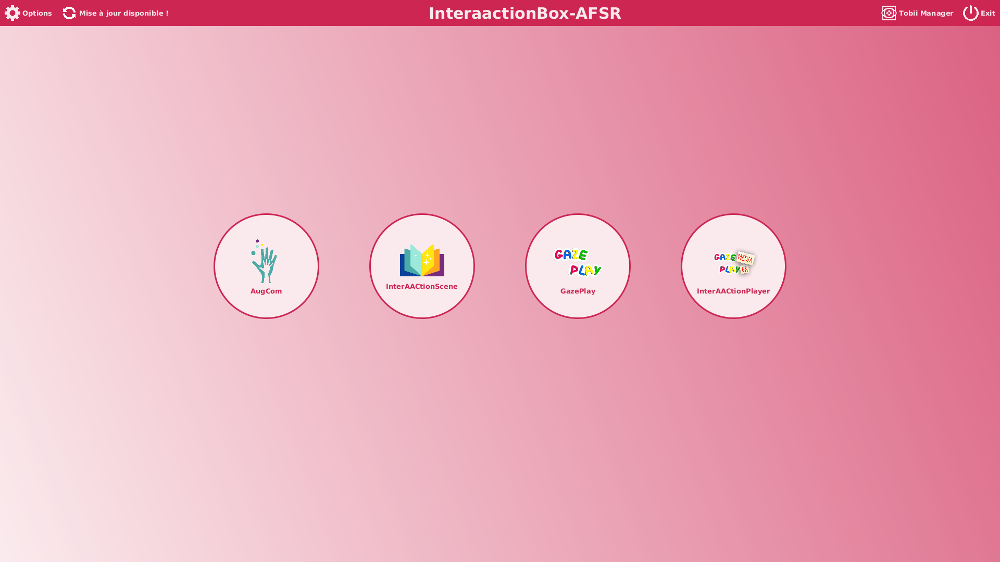
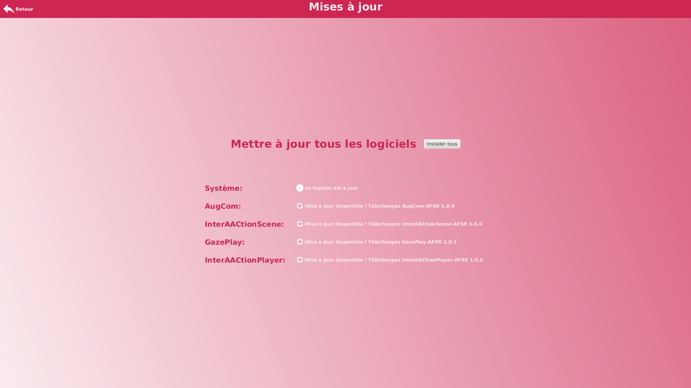

# InterAACtionBox-Live

## Etape 1: Téléchargement de l'ISO

Le fichier est disponible ici :
- https://www.swisstransfer.com/d/977a58c2-4174-4bf3-84b9-ff84378b28ae

## Etape 2: Graver l'ISO téléchargé sur la clé USB

- Utiliser Startup Disk Creator sur Ubuntu

Après avoir téléchargé startup Disk creator cette fenêtre apparait.

Il faudra choisir le périphérique où graver l'ISO. 
Puis aller sélectionner l'ISO à graver.

Au moment de graver l'ISO sur la clé USB, une fenêtre d'avertissement apparaîtra.

Cliquer sur "oui".

Après plusieurs minutes d'attente, cette fenêtre apparaîtra si tout s'est bien passé.

- Utiliser [Rufus](https://rufus.ie/fr/) sur Window (télécharger ici : https://rufus.ie/fr/)

Il vous faudra choisir le périphérique où graver l'ISO.  
Puis aller sélectionner l'ISO que à graver.

Lors du clique sur le bouton "démarrer" cette fenêtre apparaîtra.

Laisser le choix recommandé puis appuyer sur "OK".  

Il est possible que cette fenêtre s'ouvre.

Accepter en cliquant sur "Oui". 

Si tout s'est bien passé, cette fenêtre apparaîtra.

- Utiliser [mac tool](https://ipom.fr/2019/07/03/creer-windows-10-bootable-graver-un-fichier-iso-sur-usb-dvd-cd-sur-mac-os-x/) on Mac

## Etape 3: inséré la clé USB dans l'ordinateur

cf https://github.com/InteraactionGroup/InterAACtionBox pour voir l'ordinateur que nous avons sélectionné.

## Etape 4: boot sur la clé USB

- 2 possibilités pour accéder au menu BIOS [BIOS menu](https://www.dell.com/support/kbdoc/fr-fr/000126121/acc%c3%a8s-%c3%a0-la-configuration-syst%c3%a8me-uefi-bios-sous-windows-sur-votre-syst%c3%a8me-dell#:~:text=Appuyez%20sur%20la%20touche%20F2%3E%20sur%20l'%C3%A9cran%20du%20logo,pendant%20le%20d%C3%A9marrage%20du%20syst%C3%A8me)

Une fois dans le menu BIOS.

Il faudra aller dans la rubrique "Boot configuration".

Puis il faudra réorganiser les lignes en mettant les ports USB en premier.

Pour finir, appliquer les modifications et redémarrer l'ordinateur.

## Etape 5: installation de l'OS

Avant d'arriver au menu, cet écran de chargement s'affichera, veuillez patienter..

Vous allez arriver sur le premier écran.

Sélectionner "installer interaaaction".  

Choisir la langue de votre clavier.

Choisir votre réseau Wi-Fi (Attention, pour installer les logiciels ou faire les mises à jour une connexion internet est obligatoire !).

Choisir l'installation minimale et laisser le reste par défaut.

Le type d'installation va être demandé, ici 2 choix s'offrent à vous :

- Soit vous décidez de créer un dual boot et vous sélectionnez le premier choix (mais vous aurez assurément des complications si vous avez un window au parallèle).
- Soit vous décidez d'écraser votre ancien système d'exploitation et mettre celui-ci à la place, dans ce cas prendre le second choix.

Si vous prenez le second choix vous aurez une fenêtre qui vous demandera si vous êtes sûr d'écraser le système d'exploitation précédent.

Cliquer sur continuer.  

Sélectionner votre ville puis continuer.

Créer votre utilisateur avec un nom et un mot de passe puis continuer.

Ubuntu va s'installer veuillez attendre.

Une fois l'installation terminée, une fenêtre va apparaître et vous demandera de redémarrer, appuyez sur "redémarrer maintenant".

Au redémarrage, l'interAACtion box se lance automatiquement, il vous faudra aller dans "Mise à jour disponible !" en haut à gauche de l'écran.

Sur cette page, vous devez appuyer sur "installer tous" pour avoir accès à toutes les applications.

## Bug connu

Si l'interAACtion box vous bloque dans les menus et que vous devez sortir, allumez l'ordinateur, sortez du mode veille et allez dans le menu utilisateur, puis redémarrez l'ordinateur.
